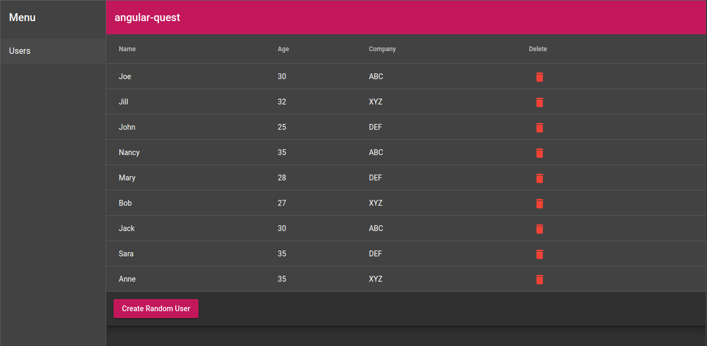

# AngularQuest

## How to run this project

    ng serve

This will start the application in development mode under http://localhost:4200.



##### Features

- Create random users
- Delete users (through the trash icon button)
## Tasks

Start by cloning the repository:

    git clone https://development.ecubit.it/ext/ecubit-angular-tech-task.git

On this project we want to implement some basic tasks.

- Are there better ways to create a `GenericDialogComponent` instance that avoids the need to specify each times the following code? (if yes, implement it and modify `UserSummaryComponent`)
```typescript
this.diag.open(GenericDialogComponent, {
  data: {
    title: 'Add random user',
    msg: 'Are you sure you want to add a random user?',
    okMsg: 'Add',
    noMsg: 'Cancel',
    enableActions: true
  }
})
...
```

- We want to implement lazy routing for `UserSummaryComponent`, feel free to add a new module and implement the current route defined in `app.routing.ts` as a lazy route.

#### Bonus features
Provide a `SharedModule` that exports the material components and the `GenericDialogComponent` defined into `app.module.ts`.

## Side notes
**Please do not spend more than 2 hours on this project**, as this would not be
respectful of your time.

## Publish your results

Create a new public repository on GitHub (or similar) and publish your results.
